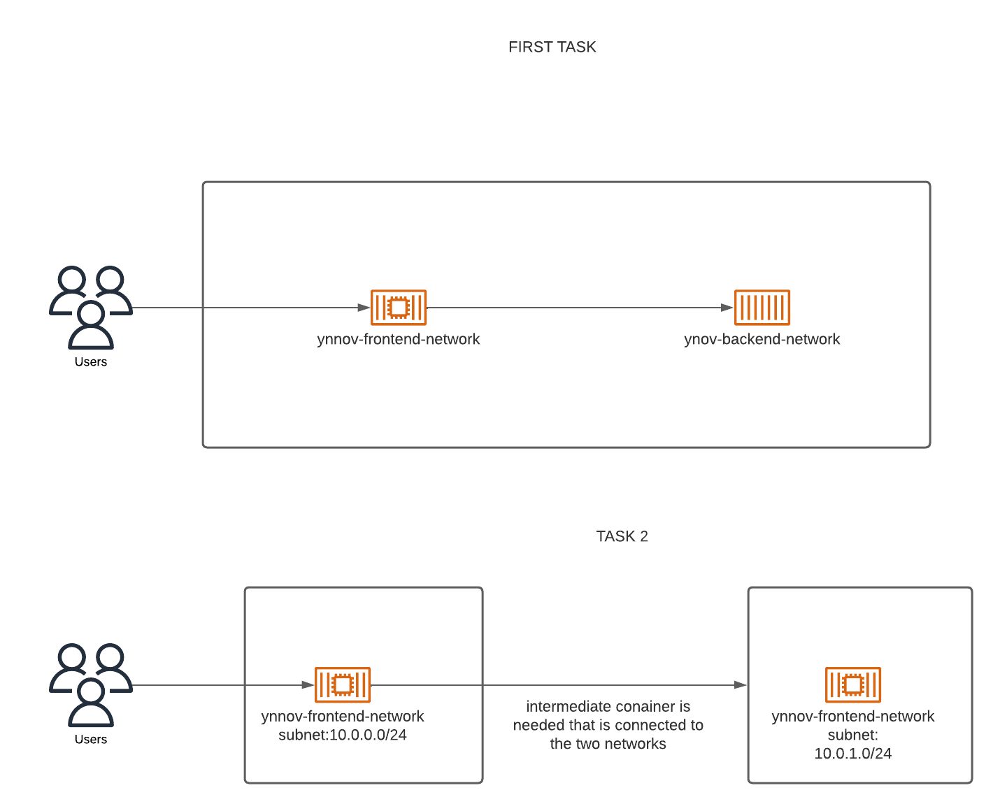

# docker_tp_shad_bout
#### Teamates
Belghiti Boutaina
Bodje Shadrack

## Docker networking

The prestashop image available [Prestashop image avaible here](https://hub.docker.com/r/bitnami/prestashop) can be used to deploy an e-commerce application. This application make use of two components. a frontend website and a database for storing persistante data.

## Architecture

## Task1
Subject : Deploy this application inside a network. Make sure the two containers can communicate with each other using their names.

### 1- create network 
docker create network reseau_ynov

### 2- Create container with mariadb image
docker run -d --name ynovdb --network reseau_ynov -e MYSQL_ROOT_PASSWORD=test1234 -e MYSQL_DATABASE=ynov_db -e MYSQL_USER=ynov_user -e MYSQL_PASSWORD=test1234 -v data:/var/lib/mysql mariadb

### 3- create container with prestashop image
docker run -d --name frontend --network reseau_ynov -e DB_SERVER=mariadb_ynov -e DB_NAME=ynov_db -e DB_USER=ynov_user -e DB_PASSWD=test1234 -p 8080:80 -v frontend_data:/var/data/html prestashop/prestashop

### 4- install commandes ping in ynovdb
docker exec -it ynovdb bash
apt-get update
apt-get install iputils-ping
exit

### 5- install commandes ping in frontend
docker exec -it frontend bash
apt-get update
apt-get install iputils-ping

### 6- Ping frontend to ynovdb 
ping ynovdb
exit

### 6- Ping ynovdb to frontend 
docker exec -it ynovdb bash
ping frontend
exit

Go to this url to see the site : http://localhost:8080/install/

## Task 2

### 1 - Create subnets
docker network create --subnet=10.0.0.0/24 frontend_network
docker network create --subnet=10.0.1.0/24 backend_network

### 2 - Connect frontend to frontend_network
docker network connect frontend_network frontend

### 3 - Create ynovdb to backend_network
docker network connect backend_network ynovdb

### 4 - Create a dockerfile
FROM httpd
RUN apt update -y 
RUN apt install -y iputils-ping
RUN apt install -y inetutils-traceroute
RUN apt install -y iproute2
RUN apt install -y curl telnet dnsutils vim

### 5 - build the image where the dockerfile is located
docker build -t nhttpd .

### 6 - Create a dockerfile
apt install -y inetutils-traceroute
apt install -y iproute2
apt install -y curl telnet dnsutils vim

### 7 - Create router and affect it to frontend_network (build image nginx before)
docker run -d --privileged --name router --network frontend_network nginx

### 8 - affect router to backend_network
docker network connect backend_network router

### 9 - Verify
docker inspect router

### 10 - Install
docker exec -it router bash
apt-get update
apt-get install iputils-ping
apt install -y inetutils-traceroute
apt install -y iproute2
apt install -y curl telnet dnsutils vim

### 12 - ip route
docker exec -it router bash
Ip route add 10.0.0.0/24 via 10.0.0.3
Ip route add 10.0.1.0/24 via 10.0.1.0
